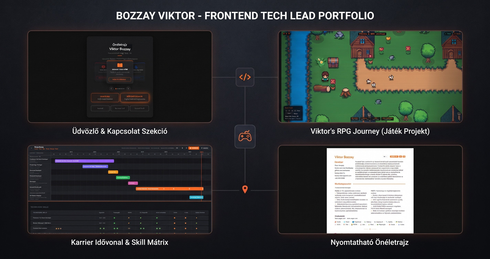

# Developer Portfolio

A clean, interactive developer portfolio built with **vanilla HTML, CSS and JavaScript**, no frameworks, no build tools.

**🌐 Live site: [exphoenee.github.io/dev-portfolio](https://exphoenee.github.io/dev-portfolio/)**, hosted on GitHub Pages.



## ✨ Features

- 🌗 **Light / Dark mode**, respects your system preference, toggle saved in `localStorage`
- 🌍 **6 languages**, English, Deutsch, Magyar, Français, Italiano, Español (auto-detected, switchable, and linkable via `?lang=de`)
- 📦 **21 real projects**, data collected from the actual repositories (e.g. AGX AI Translation Helper, FACTS Driver App, Szela Coaching)
- 🖼️ **Project illustrations**, logos and screenshots from each project, with an image lightbox
- 🔀 **Functional / Technical tabs**, every project card switches between a functional and a technical description
- 🗂️ **Category filters**, Libraries, Games, Apps & Tools, APIs, Websites
- 🧩 **Template-driven architecture**, all content is rendered from a central data file (`data/portfolio-data.js`) plus per-language locale files (`data/locales/*-page.js`), mirroring the CV project
- 🖼️ **Custom pixel-art contact icons**, hand-made icons for the contact cards (email, booking, GitHub, LinkedIn, resume)
- 🤖 **Robotics skills**, synced from the CV repo (Universal Robot, KUKA, FANUC, OnRobot, Machine Vision)
- ⌨️ **Typing effect, animated counters, scroll reveals, terminal hero**
- 📱 **Fully responsive**, mobile menu, fluid grid

## 🏗️ Project structure (templating, mirrors the CV project)

```
dev-portfilio/
├── .github/
│   └── workflows/
│       └── deploy.yml       ← GitHub Actions: validates JS + publishes to Pages
├── data/
│   ├── portfolio-data.js   ← single source of truth: PROJECTS, TIMELINE, SKILLS, CONTACT
│   └── locales/
│       ├── en-page.js      ← UI labels per language (CV-style *-page.js)
│       ├── de-page.js
│       ├── hu-page.js
│       ├── fr-page.js
│       ├── it-page.js
│       └── es-page.js
├── scripts/
│   ├── main.js             ← entry point: wiring only
│   ├── config.js           ← shared constants (theme/lang keys, endpoints)
│   ├── locale.js           ← LocaleManager: language detection, storage, t()
│   ├── dom.js              ← $, $$, t helpers
│   ├── state.js            ← shared view state (lang, theme, filter, card tabs)
│   ├── ui/                 ← theme, typed effect, scroll reveal, stat counters
│   ├── render/             ← one module per data-driven section + translate.js
│   └── modals/             ← modal/turnstile/form-guard primitives + hire, booking, image
├── tools/
│   └── check-syntax.mjs    ← `npm run check`: parses every JS source (also used by CI)
├── tests/
│   └── data.test.mjs       ← `npm test`: locale parity, asset and data integrity
├── styles/
│   ├── portfolio.css       ← base, layout and section styles
│   └── modals.css          ← hire / booking / lightbox (loaded after portfolio.css)
├── index.html              ← thin shell; skills & contact are rendered by JS
├── .gitignore              ← OS/editor junk, node_modules, backup images
└── assets/images/
    ├── projects/        ← project images (21) in small/, large/ and og/ sizes
    ├── tech/            ← tech icons
    ├── **/backup/       ← full-resolution originals: on disk, git-ignored
    └── favicon.svg
```

> Only the optimized images are committed. The originals under any
> `backup/` folder stay local, they are ~99 MB and would otherwise ride
> along in every Pages deployment.

## 🚀 Hosting on GitHub Pages (GitHub Actions)

The repo ships with a GitHub Actions workflow (`.github/workflows/deploy.yml`) that **validates the JavaScript sources and publishes the site to GitHub Pages** on every push to `master` (or on demand via *Actions → Deploy to GitHub Pages → Run workflow*).

1. Create a repository on GitHub (e.g. `dev-portfilio`) and push this folder:

   ```bash
   git init
   git add .
   git commit -m "Initial portfolio"
   git remote add origin https://github.com/YOUR_USERNAME/dev-portfilio.git
   git push -u origin master
   ```

   > If your `git init` created a `main` branch instead, either rename it
   > (`git branch -M master`) or change `branches:` in `deploy.yml` to match.

2. Go to **Settings → Pages** in the repository.
3. Under **Build and deployment**, set **Source** to **GitHub Actions**.
4. Push (or run the workflow manually via *Actions → Deploy to GitHub Pages → Run workflow*), the site will be live at `https://YOUR_USERNAME.github.io/dev-portfilio/`. Every subsequent push to `master` redeploys automatically.

   > ⚠️ The first workflow run may show a *failed* deploy step if it ran before the Pages source was set to GitHub Actions, that's expected; the next push redeploys successfully.

> 💡 **Tips:**
> - For a custom domain, add a `CNAME` file containing your domain and configure the DNS record.
> - For **private** repositories, the first deployment to the `github-pages` environment needs manual approval inside the Actions run (public repos deploy automatically).

## ✏️ Customizing

- **Projects**, edit the `PROJECTS` array in `data/portfolio-data.js` (name, category, image, tech, links and descriptions in all 6 languages).
- **Skills**, the `SKILLS` array in `data/portfolio-data.js` is synced from the CV repo's `cv/cv-data.js` `skillGroups` (primary, frontend, backend, testing, tooling, ai, robotics) + spoken languages; chip icons resolve through `scripts/tech-icons.js`.
- **Contact cards**, edit the `CONTACT` array in `data/portfolio-data.js`; each card's `icon` can be an emoji, an inline SVG or an `` pointing to a custom image in `assets/images/`.
- **Career timeline**, edit the `TIMELINE` array in `data/portfolio-data.js`.
- **UI labels** (nav, hero, buttons, footer…), edit the matching key in each `data/locales/*-page.js` file.
- **Colors**, tweak the CSS variables in the `:root` / `[data-theme]` blocks of `styles/portfolio.css`. The two `theme-color` meta tags in `index.html` mirror `--bg`; keep them in sync.

> The portfolio uses ES modules (`<script type="module">`), so serve it over HTTP (e.g. `npx serve` or GitHub Pages), opening `index.html` directly via `file://` blocks module loading.

## 🛠️ Tech Stack

| Layer         | Technology                            |
|---------------|---------------------------------------|
| Markup        | Semantic HTML5                        |
| Styling       | CSS3 (custom properties, animations)  |
| Logic         | Vanilla JavaScript (ES6+)             |
| Fonts         | Sora, Inter, JetBrains Mono (Google Fonts) |
| Hosting       | GitHub Pages (GitHub Actions)         |

## ✅ Checks

No dependencies, so nothing to install, both commands run on plain Node:

```bash
npm run check   # node --check over every file in scripts/ and data/
npm test        # locale key parity, asset existence, data integrity
npm run verify  # both
```

The deploy workflow runs the same two commands before it publishes.

## 📄 License

[MIT](LICENSE.md), free to use and modify.
